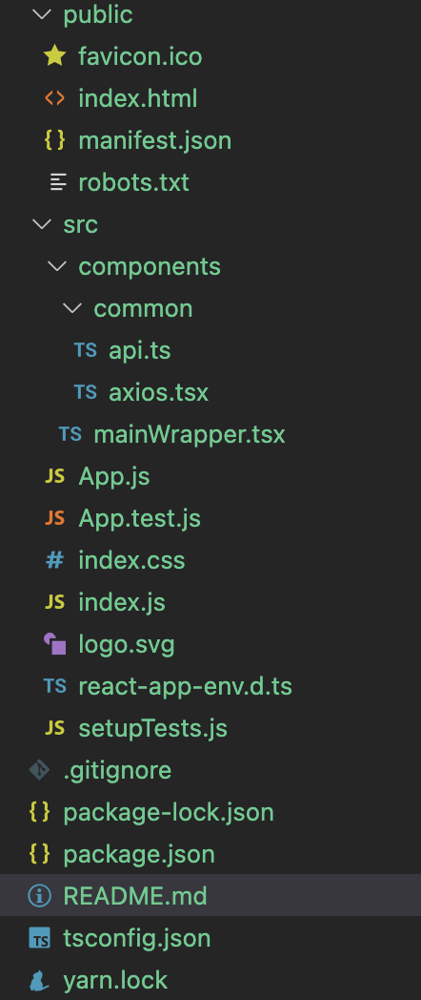

# Pokemon APP

This project was bootstrapped with [Create React App](https://github.com/facebook/create-react-app).

## Description
PUBLIC URL USED: https://pokeapi.co/

## Folder Structure

## Components

* mainWrapper - serves the main page and lists pokemons
* brokenScreen - serves broken page with an image when url didn't fetch data or something went wrong
* headerComponent - serves the nav bar space and handles prev/next button 
* loader - serves pokeball when page is loading (#using codepen code#)

## Favicon
favicon is pokeball logo (Generated online)

## Features 
1. Has suspense, lazyloading, abortcontroller, customhook, promise fetch, memoization, performance component. 

## Improvements
1. I can see why the content isn't updating fast enough in slow 3G or slow 4G network. Need to see what is the FCP.
2. Need to change it to vite pretty soon but I can live with CRA for now.
